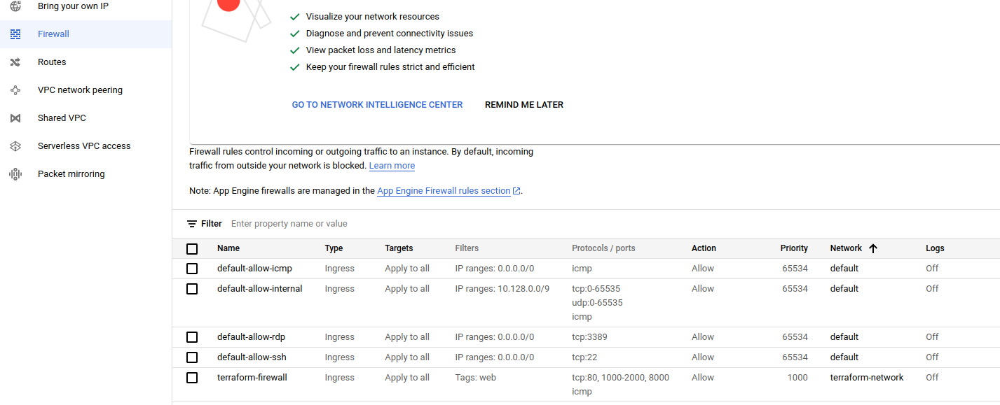

# Homework 1
## Hashicorp terraform GCP base course
terraform file [location](./hashicorp_base_gcp_course)

Proof of finishing course\

Created VPC network\

Created Firewall rules\

Created VM instance\

#### variables for learning
project `terraform-learning-349712`\
credentials_file `~/GCP/secrets/terraform_learning_service_account.json`

#### for taking state file in gcp object storage
`export GOOGLE_APPLICATION_CREDENTIALS="$HOME/GCP/secrets/terraform_learning_service_account.json"`
