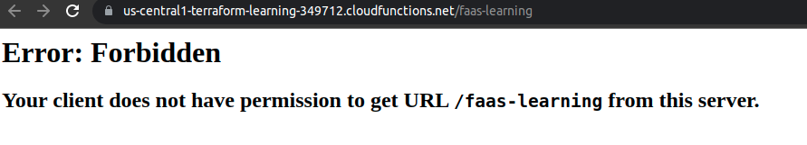
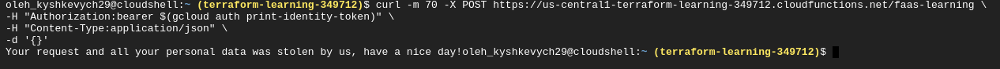
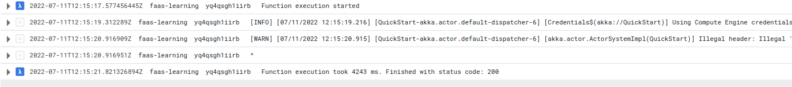
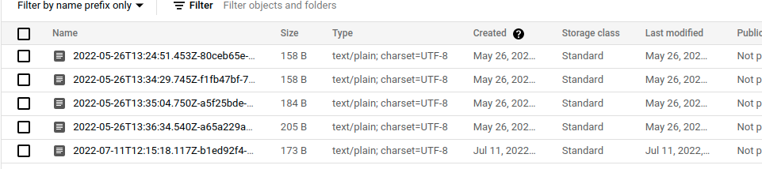
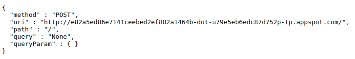

# Cloud Function

To deploy **Cloud Function** you need to specify path to source code. So I need to use **Cloud Source Repositories**. It can connect to github repository like this


After writing my function, I've decided to deploy it by using [terraform](./terraform/main.tf).

I've added authentication, so only my user can trigger this function. 
Here is example what will happen if you try to trigger function being unauthorized.

   

To trigger Cloud Function you need to provide [access token](https://cloud.google.com/functions/docs/securing/authenticating#authenticating_developer_testing)

By authenticating to gcloud cli I can run 
```bash
curl -m 70 -X POST https://us-central1-terraform-learning-349712.cloudfunctions.net/faas-learning \
-H "Authorization:bearer $(gcloud auth print-identity-token)" \
-H "Content-Type:application/json"
```


You can see logs of execution



And result is stored to the GCP Object Storage



Content of this request

