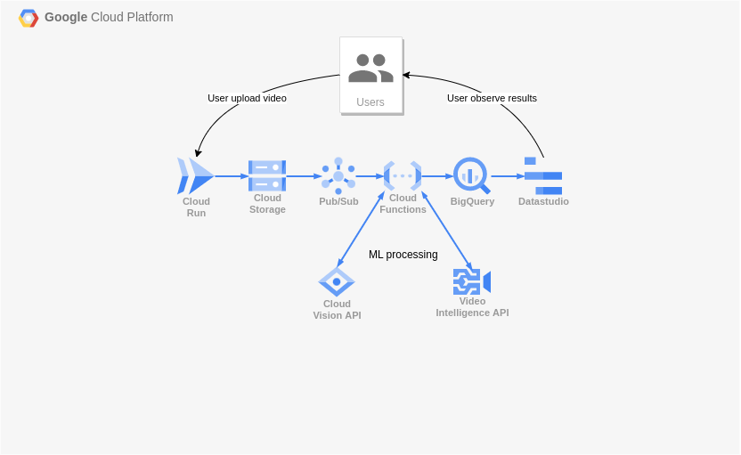

# Capstone project
## Processing video stream

### Idea
To build pipeline that will process video stream. Tries to identify objects on video (what they are and how they're moving)

### High-level design

Prepare a data set - a video file that consists of some objects.\
Prepare a Pub/Sub (kafka) environment.\
Generator microservice that splits the video file to frames, sends them to Pub/Sub as messages.\
Microservice that preprocesses video frames.\
Microservice that detects objects in video frames.\
Microservice that tracks an objects in video frames.\
Microservice that generates and displays statistics :
* number of detected unique objects
* ...

### Diagrams
draft of architecture, not a finale version. But I hope that concept is understandable and will stay as it is

1. User upload a video to Cloud Run
2. Cloud Run splits video by frames and upload it to object storage with additional metadata
3. Pub/Sub gets events of new object appeared in object storage by [event notification](https://cloud.google.com/storage/docs/pubsub-notifications)
4. Parallelism (how many frames will be processed by the same time) will be controlled by partitions in Pub/Sub 
5. First Cloud Function to preprocess frames
6. Second Cloud Function to send frames on ML services
7. Cloud Vision will process frames and returns answer
8. Cloud function stores result to BigQuery
9. User can look at the cool diagrams from Datastudio
